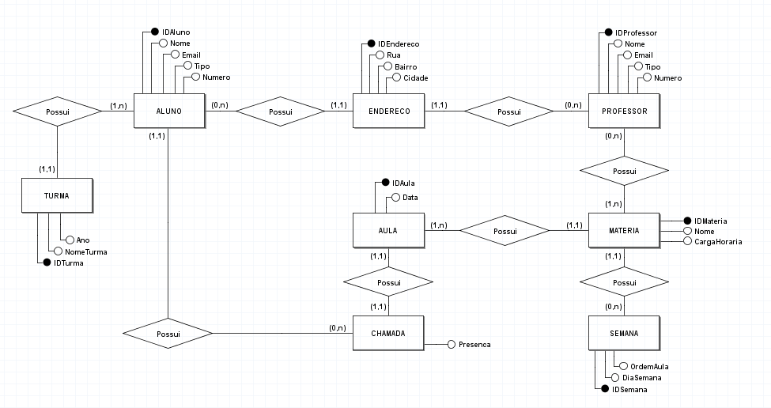
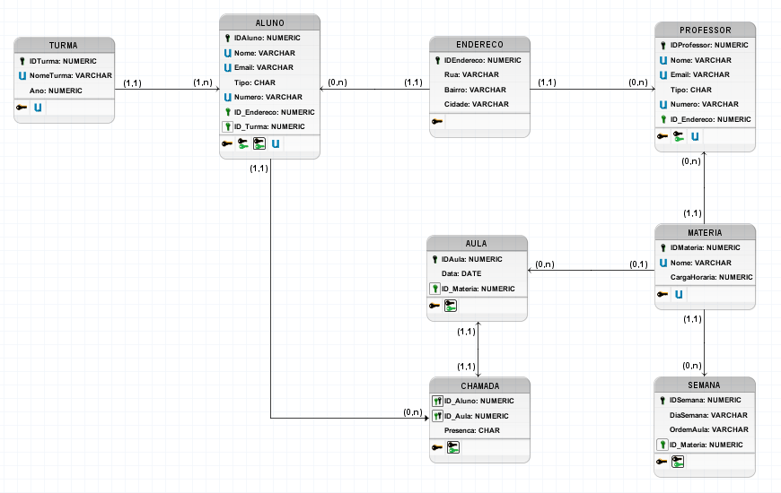

<!DOCTYPE html>
<html lang="en">
<head>
    <meta charset="UTF-8">
    <meta name="viewport" content="width=device-width, initial-scale=1.0">
</head>
<body>
  <h1>SISTEMA DE GESTÃO ESCOLAR</h1>
  <h2>Descrição do Projeto</h2>
  

    O projeto, com foco no uso educacional para gestão escolar, trará um banco capaz de armazenar diversas informações. No banco de dados terá disponibilidade para incluir, alunos, professores e suas respectivas matérias, os dois indivíduos terão registrado seu número de telefone e endereço para fins de contato. Ainda nos alunos, haverá uma lista para chamadas, onde será listado todos os alunos presentes da turma, como a matéria da aula, e o professor responsável.
  

  <h2>Recursos</h2>
  <ul>
      <li>Criação e Atualização de tabelas e seus atributos</li>
      <li>Inserção e visualização dos dados</li>
      <li>Uso do "Join" para incrementar diferentes tabelas</li>
      <li>Uso de diversas outras funções como: "WHERE", "ORDER BY & GROUP BY", "COUNT", UNION, INNER JOIN, SUBQUERIES e entre outras</li>
  </ul>

  <h2>Tecnologias Utilizadas</h2>
  <ul>
      <li>MySQL</li>
      <li>BRModelo</li>
  </ul>
  
  <h2>Modelo Conceitual</h2>
  

  <h2>Modelo Lógico</h2>
  

  
  <h2>Contato</h2>
  
Se você tiver alguma dúvida, sugestão ou quiser entrar em contato comigo, sinta-se à vontade para me enviar um e-mail em <a href="mailto:vitor.paloco@edu.unifil.com">vitor.paloco@edu.unifil.com</a> ou me encontrar em <a href="https://www.linkedin.com/in/vitor-hugo-oliveira-paloco-b64126278/">LinkedIn</a>.

</body>
</html>
